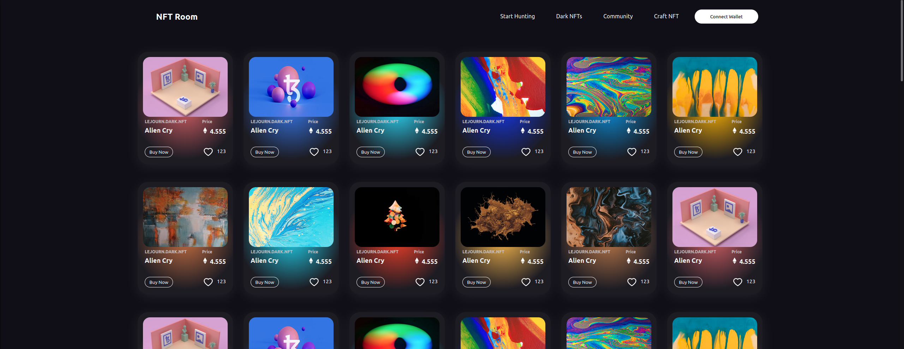
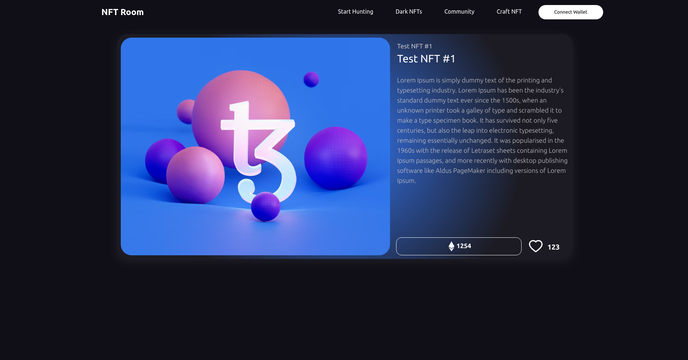

# Open Source Nft Marketplace [Onprogress %10]
<!-- ALL-CONTRIBUTORS-BADGE:START - Do not remove or modify this section -->

<!-- ALL-CONTRIBUTORS-BADGE:END -->
Reactjs And Smart Contracts Open Source Basic Nft Marketplace App

> ## ⭐ Support Us
> If you appreciate my project, please consider giving us a star rating. Your support will help us gain further recognition and attract more attention from the community. Even a single star can make a difference, as it can encourage others to also rate our project positively. Thank you for your support!

## 💪 Motivation

I aim to create an open and safe NFT marketplace that is accessible to everyone. This will be a challenging task for both myself and the contributors involved, but through our collective efforts, we can develop an open-source, reliable, and visually appealing NFT marketplace that serves as a model for others to emulate. While our goal is not to operate an NFT marketplace ourselves, we hope to provide a template that can be easily forked and customized by others, ultimately benefiting artists and creators in the process. By pooling our skills and resources from diverse backgrounds, we can succeed in building a better world.

## 🖥️ Screenshoots 

### Home

### Explore

### Nft Detail

### Augmented Reality Support

## 🎉 Roadmap

 - [x] Base Components (9/9) (Base components of the project )
 - [ ] Search Filters for Explore Page
 - [x] Connect Wallet (ETH Wallets)(Supports Other Wallets 🚀)
 - [x] NFT Detail Page
 - [ ] Smartcontract Backend (Truffle)
 - [ ] Community Page
 - [x] Login
 - [ ] NFT Create Page
 - [ ] Users Pages
 - [ ] User Collections
 - [ ] Connect Wallet Popup
 - [ ] Supported Mobile Devices
 - [x] AR supports for 3d NFTs

## 🔮 Usage
In the project directory, you can run:

### `npm install (for first running)`
### `npm start`

## Contributors ✨

Thanks goes to these wonderful people ([emoji key](https://allcontributors.org/docs/en/emoji-key)):

<!-- ALL-CONTRIBUTORS-LIST:START - Do not remove or modify this section -->
<!-- prettier-ignore-start -->
<!-- markdownlint-disable -->
<table>
  <tbody>
    <tr>
      <td align="center" valign="top" width="14.28%"><a href="https://github.com/metaversekingdom"> <b>Ryosuke Matsumoto</b></a> <a href="#content-GehadSalemFekry" title="Content">🖋</a></td>
    </tr>
  </tbody>
</table>

<!-- markdownlint-restore -->
<!-- prettier-ignore-end -->

<!-- ALL-CONTRIBUTORS-LIST:END -->

